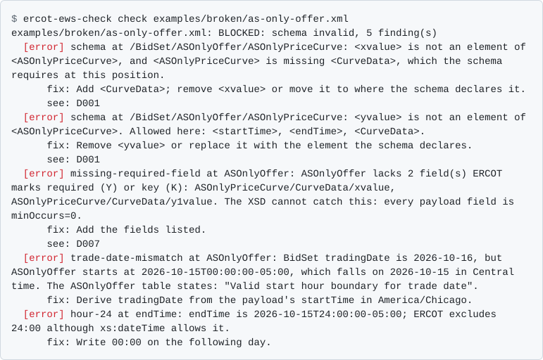
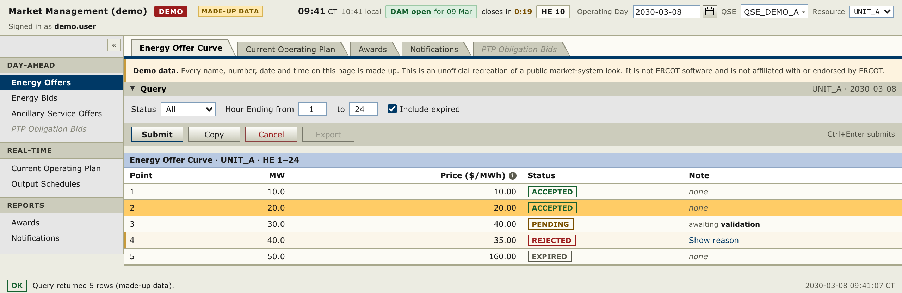
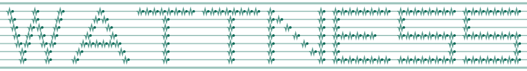

<picture><source media="(prefers-color-scheme: dark)" srcset="assets/banner-dark.svg"><source media="(prefers-color-scheme: light)" srcset="assets/banner-light.svg"></picture>

Wattness builds software for battery storage and other flexible energy assets in wholesale power markets. Most of that work is private; the two tools below are open source.

<a href="https://wattness.ai"><picture><source media="(prefers-color-scheme: dark)" srcset="assets/icon-website-dark.svg"><source media="(prefers-color-scheme: light)" srcset="assets/icon-website-light.svg"></picture></a>&nbsp;&nbsp;&nbsp;<a href="https://x.com/wattness_ai"><picture><source media="(prefers-color-scheme: dark)" srcset="assets/icon-x-dark.svg"><source media="(prefers-color-scheme: light)" srcset="assets/icon-x-light.svg"></picture></a>

### [ercot-ews-check](https://github.com/wattness/ercot-ews-check)

Checks ERCOT External Web Services (EWS) submissions before they are sent: against ERCOT's XSDs, then against the rules in ERCOT's documentation that the XSDs do not enforce. It keeps a catalogue of the places where ERCOT's EWS documentation, examples and schemas disagree.<br><sub>Python · Apache-2.0</sub>

```sh
git clone https://github.com/wattness/ercot-ews-check && cd ercot-ews-check
python3 -m venv .venv && . .venv/bin/activate    # Windows: .venv\Scripts\activate
python -m pip install .
ercot-ews-check check examples/broken/as-only-offer.xml
```

<a href="https://github.com/wattness/ercot-ews-check"><picture><source media="(prefers-color-scheme: dark)" srcset="assets/ercot-ews-check/check-broken-as-only-offer-dark.svg"><source media="(prefers-color-scheme: light)" srcset="assets/ercot-ews-check/check-broken-as-only-offer-light.svg"></picture></a>

To check one document without installing anything, open [Would ERCOT reject this file?](https://huggingface.co/spaces/wattness/ercot-ews-check) on Hugging Face. It runs this checker in your browser, so the document is not uploaded.

### [unofficial-ercot-mms-skin](https://github.com/wattness/unofficial-ercot-mms-skin)

CSS and design tokens that give in-house market-operations screens the look of ERCOT's Market Management System (MMS). Plain CSS, no framework and no runtime dependencies. It is not ERCOT software.<br><sub>CSS · MIT</sub>

```sh
git clone https://github.com/wattness/unofficial-ercot-mms-skin && cd unofficial-ercot-mms-skin
npm install            # Node 22 or later; also builds dist/
open demo/index.html   # macOS; xdg-open on Linux, start on Windows
```

<a href="https://github.com/wattness/unofficial-ercot-mms-skin"></a>

<sub>Neither tool is affiliated with or endorsed by ERCOT.</sub>

<picture><source media="(prefers-color-scheme: dark)" srcset="assets/wordmark-dark.svg"><source media="(prefers-color-scheme: light)" srcset="assets/wordmark-light.svg"></picture>
